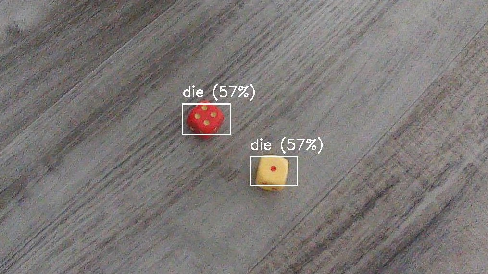

# 🎲 Tensorflow Lite die detection and classification

This repository is an exploration using Tensorflow Lite to train models to detect and classify die.

## Tensorflow setup

Follow the [setup instructions](https://www.tensorflow.org/install) to install Python and Tensorflow on your machine.

## Repository structure

### `image_data`

This directory contains all the images and metadata for training, testing, and validating the models.

If you would like to use and improve these models, submitting additional images and metadata would be helpful to improve training!

### `model_makers`

This directory contains the following models which are built using [Tensorflow Lite's `tflite_model_maker`](https://www.tensorflow.org/lite/api_docs/python/tflite_model_maker) module with Python.

- `die_detection_and_classification`: an attempt to detect die and label them _(1-6)_ in a single detection model. This was abandoned in favor of a two-step process: first detecting, then classifying.
- `die_detection`: a model using [object detection](https://www.tensorflow.org/lite/examples/object_detection/overview) to detect dice within images.
- `die_classification`: a model using [image classification](https://www.tensorflow.org/lite/examples/image_classification/overview) to label die with the appropriate class _(1-6)_.

To train and create these models, change into the corresponding directory (eg: `cd model_makers/die_detection`), and run `python model_maker.py`.

### `output_models`

This directory contains the trained models output from the `model_makers` above. This file can be copied and used with other Tensorflow Lite packages for mobile and web applications.

Each directory contains additional Python scripts for testing these output models and using them for other steps. For example, the object detection model is used to crop each die to be used as the training data for the image classifier model.
